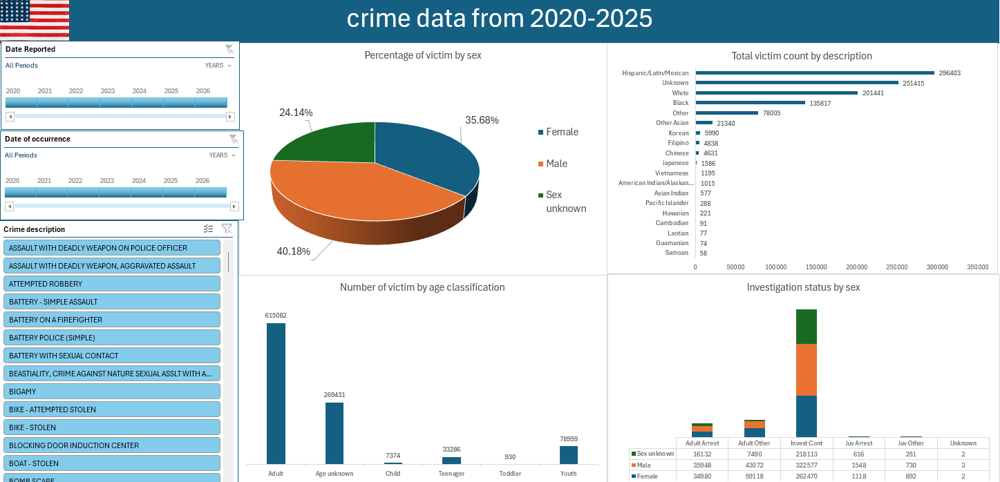

# Project 1

**Title:** [Crime dashboard 2020-2025](https://docs.google.com/spreadsheets/d/1zuj3aiXXbhhsVk1ethynyryeiND7E69S/edit?usp=drive_link&ouid=104371179055584598386&rtpof=true&sd=true)

**Tools Used:** Microsoft Excel (Slicers, Pivot charts, pivot table, timeline,power query)

**Project Description:**

**Key findings:**

**Dashboard Overview:** 

# Project 2

**Title:** Football data

**SQL Code:** [Football data-data interrogation and manuipulation](https://github.com/OduPraie/OduPraie.github.io/blob/main/Football_data.SQL)

**SQL Skills Used:** 

Data Retrieval (SELECT): Queried and extracted specific information from the database.

Data Aggregation (SUM, COUNT): Calculated totals, such as sales and quantities, and counted records to analyze data trends.

Data Filtering (WHERE, BETWEEN, IN, AND): Applied filters to select relevant data, including filtering by ranges and lists.

Data Source Specification (FROM): Specified the tables used as data sources for retrieval

**Project Description:**

**Technology used:**: SQL server
